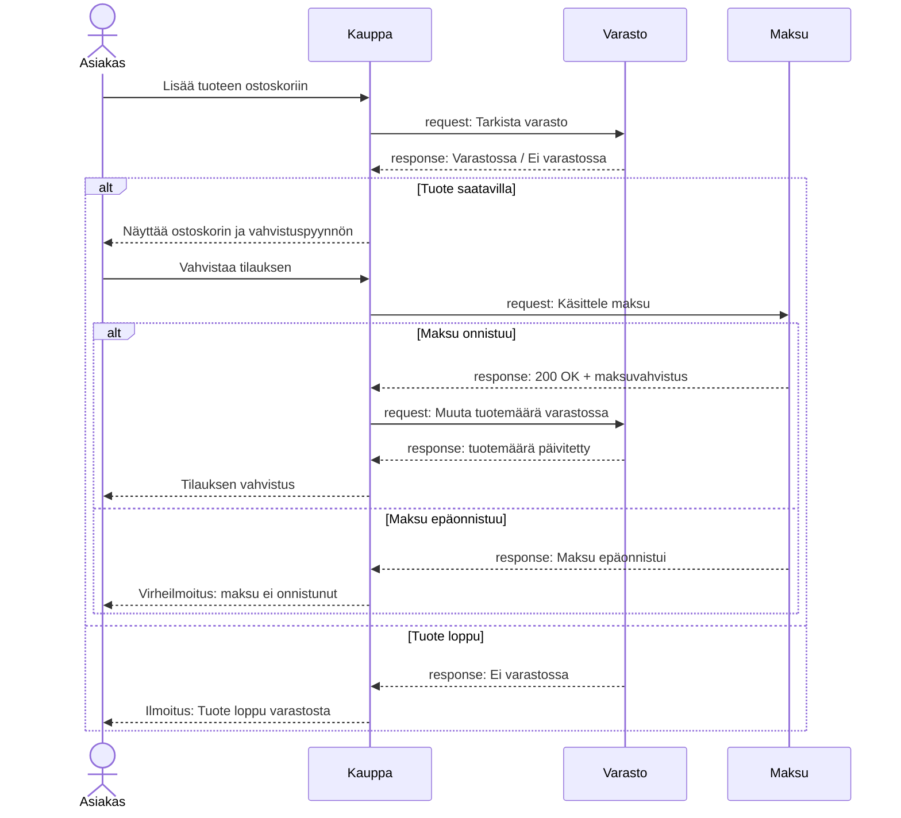

# sekvenssikaavio - verkkokauppa

```mermaid
sequenceDiagram
    actor Asiakas
    participant UI as Kauppa
    participant Varasto as Varasto
    Participant Maksu as Maksu

    Asiakas->>UI: Lisää tuoteen ostoskoriin
    UI->>Varasto: request: Tarkista varasto
    Varasto-->>UI: response: Varastossa / Ei varastossa

    alt Tuote saatavilla
        UI-->>Asiakas: Näyttää ostoskorin ja vahvistuspyynnön
        Asiakas->>UI: Vahvistaa tilauksen
        UI->>Maksu: request: Käsittele maksu

        alt Maksu onnistuu
            Maksu-->>UI: response: 200 OK + maksuvahvistus
            UI->>Varasto: request: Muuta tuotemäärä varastossa
            Varasto-->>UI: response: tuotemäärä päivitetty
            UI-->>Asiakas: Tilauksen vahvistus
        else Maksu epäonnistuu
            Maksu-->>UI: response: Maksu epäonnistui
            UI-->>Asiakas: Virheilmoitus: maksu ei onnistunut
        end
    
    else Tuote loppu
        Varasto-->>UI: response: Ei varastossa
        UI-->>Asiakas: Ilmoitus: Tuote loppu varastosta
    end

```