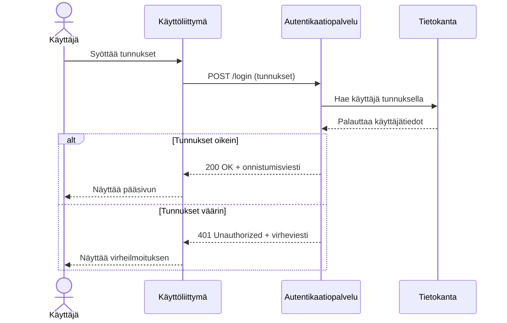

# sekvenssikaavio - kirjautumiseen

```mermaid
sequenceDiagram 
    actor Käyttäjä
    participant UI as Käyttöliittymä
    participant Auth as Autentikaatiopalvelu
    participant DB as Tietokanta

    Käyttäjä->>UI: Syöttää tunnukset
    UI->>Auth: POST /login (tunnukset)
    Auth->>DB: Hae käyttäjä tunnuksella
    DB-->>Auth: Palauttaa käyttäjätiedot

    alt Tunnukset oikein
        Auth-->>UI: 200 OK + onnistumisviesti
        UI-->>Käyttäjä: Näyttää pääsivun
    else Tunnukset väärin
        Auth-->>UI:401 Unauthorized + virheviesti
        UI-->>Käyttäjä: Näyttää virheilmoituksen
    end
``` 